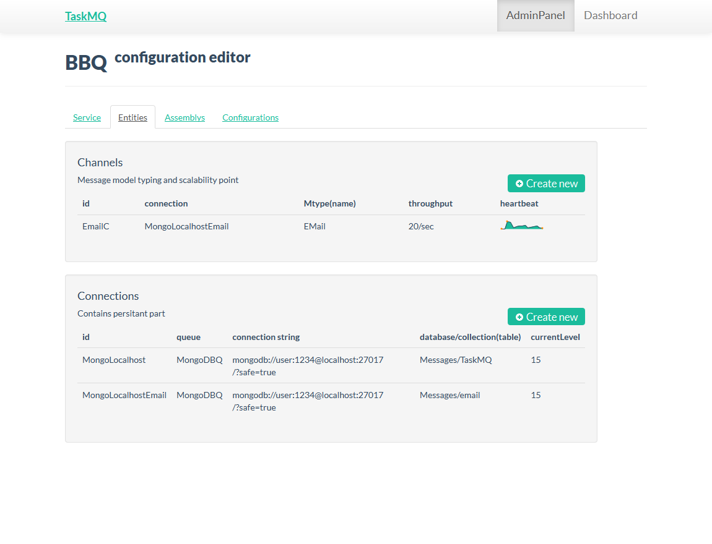
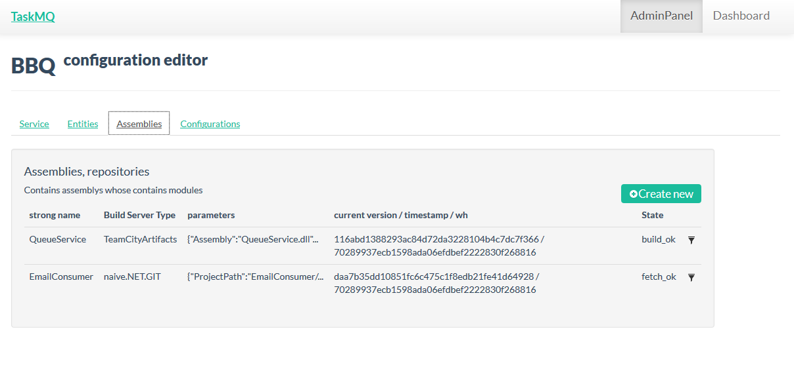
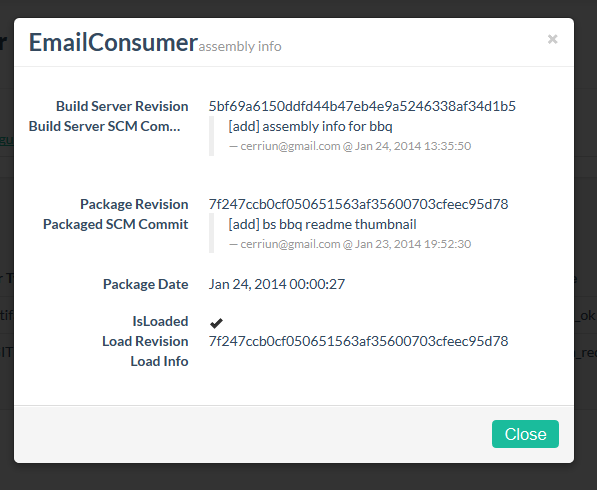

#TaskMQ#

**The version of this file is preliminary**

**BBQ can used static-hosted, for example - on github-pages: [skipme.github.io/BBQ_static](http://skipme.github.io/BBQ_static)**

##Introduction##

Suppose you have some enterprise application consists with modules implementing BL or other features.
Usually this modules separated by web-services and communicates between each other and with main application, deliver information(e-mail, sms), deliver api level messages, workflow system nodes.

The main idea with this this project is bring control(distribution and testing) on periodic tasks and take it distal from main part of your code, with their specific ifrastructure - like performance ballancing.

Of course for all of that you can use distributed message queues or develop communication network(wcf or some web service stack with REST api or SOAP), **taskmq** tries to do it for you without thinking about deploying and configuration applications, complex distributed architecture instead of this - you can get focus on functional role of your task-specific part(or other meaning of asynchronous/delayed jobs).

The **channel** realise a functional approach, now it only means what in domain part you choose **model** (class), populate and push it to taskmq, *taskmq* picks **channel**, **queue** and eventually invoke specific module.

###Conception###

The concept focuses on the implementation of the project scale, this is achieved by the distribution of tasks to compute nodes via a message queue. In the simplest case, this is sufficient, however, require the full depth of the CQRS approaches, such as events and store denormalized data. This solution tries to combine the approaches of queues and services, simplifying the deployment and updates, and DDD approach commands change the state of the domain store events, followed by de-normalization of domain data for read requests.

##Entities##

###Queues###

**Queue** designed for flexible usage and help you with implementing *any flow* you need. Queue consists message *model*, you extend the basic model with any field. Basic model of message contains type string( *MType* ), *Processed* flag, and timestamps. MType used for channel selection, other parameters for *take*(pop) operation which in default selector(fifo selector) - of course you can implement any selector for your fields, for example priority number:
~~~
TQItemSelector selector = new TQItemSelector("Processed", false)
   .Rule("Priority", TQItemSelectorSet.Descending)
   .Rule("AddedTime", TQItemSelectorSet.Ascending);
~~~

And a very important feature of queues: after module process message you can keep message in queue and, or, change field values.

###Channels###

**Channels** take a message  distribution role   for modules, it realise the scalability as on the same machine as like on separate application instances.

##Configuration, Statistics, Web-access##

Default access module implemented with service stack and self-hosted within application, so you can simply push messages with http protocol at **tmq/q** with PUT method, also at **tmq/c** open access to the configuration. **BBQ** is web interface for simply view and modify all entities on taskmq server, show statictics, maintain queues.

BBQ web interface: 
 
 
 
